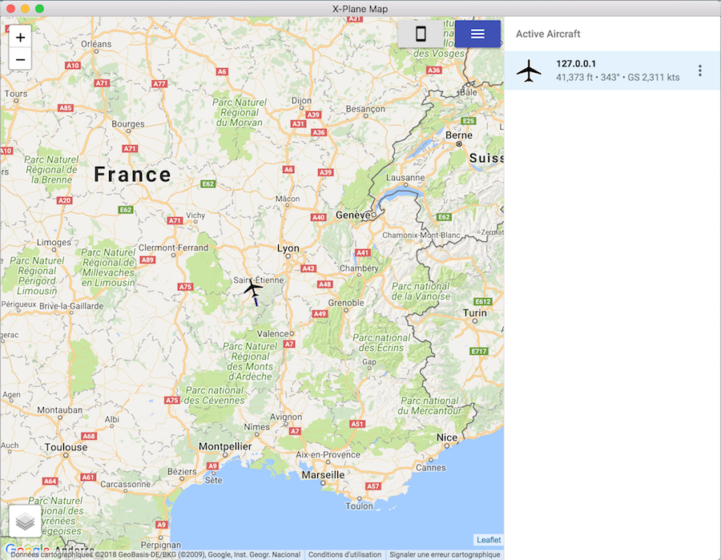

# Airspaces

**Airspaces** is a web and desktop companion app to [X-Plane](https://www.x-plane.com/), a flight simulator. It provides an online map where you can track your plane flying, along with your friends, or the whole world of X-Plane simmers!

⚠️ Airspaces is no longer maintained. Il will keep working as long as it costs minimal effort to me. Technical support is mostly not provided anymore. ⚠️

## General information

### Links

- Website and instructions : https://airspaces.app
- Public Airspace : https://public.airspaces.app

### Can I help you?

If you have a bug report, a feature request, or just any question, you can either [create an issue on Github](https://github.com/foucdeg/airspaces/issues).

### Helping out

Thanks for your interest! Here are a few ways to help me improve Airspaces:

- by reporting bugs of feature requests here in the issues of via email - see above
- by contributing with code, if you are a developer. The technologies involved are Node.JS, ReactJS and Docker. PRs are welcome. See the "Development" section below.
- if you wish, by donating a small amount of money via Paypal: 

## Development

Unless you are a developer interested in contributing to Airspaces, you probably should have clicked one of the above links.

Airspaces (excluding the desktop app) is composed of a React.JS frontend and a Node.JS backend. Both use Typescript.

### Requirements

- Node.JS version 10 or above LTS
- yarn version 1.15 or above.

### Getting set up

Here is how to get set up:

- Clone the repo: `git clone git@github.com:foucdeg/airspaces.git`

- Then in a terminal, install frontend dependencies and run the frontend:

`cd frontend && yarn && yarn start`

In another terminal, do the same for the server.

`cd server && yarn && yarn start`

The server is now running on port 9000 and will be listening for X-Plane UDP packets on port 49003. The frontend is now running on port 3000 and should have opened a window in your browser.

Optionnally, in a third terminal, you can run a fake plane signal sending its data to your server:

`cd server && yarn fake`

### Build and deploy

You are free to use the Dockerfile to build a Docker image of the server:

`docker build -f ./docker/api/Dockerfile . -t foucdeg/airspaces:api`

You won't be able to push an image named `foucdeg/airspaces:api` to Docker Hub, because, well, that's my name. Just use your Docker Hub username instead and you'll have a working Docker image of Airspaces with your changes!

### Website

This repository also includes the source code for the main website, https://airspaces.app. It is a Github Pages website, Github automatically builds it.

I run it locally using the following command:

    docker run \
      -t --rm \
      -v "$PWD":/usr/src/app \
      -e JEKYLL_GITHUB_TOKEN=$JEKYLL_GITHUB_TOKEN \
      -p "4000:4000" starefossen/github-pages

`$JEKYLL_GITHUB_TOKEN` is a Github access token to allow the local container to fetch the data from Github that builds the website.
