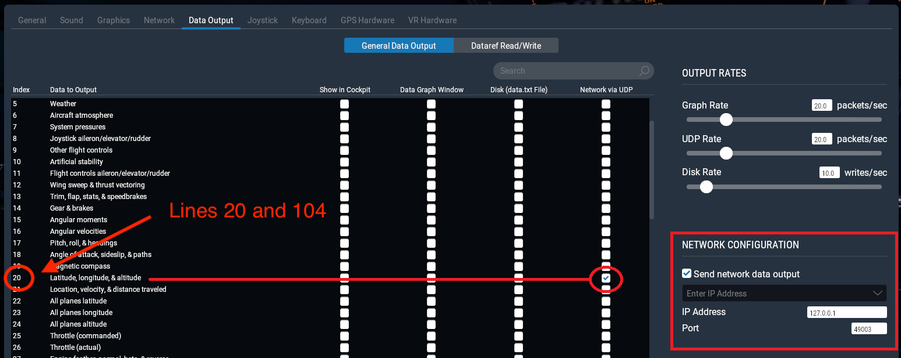

## X-Plane Config

### X-Plane 11

In Settings > Data Output, under the General Data Output tap, check data lines **20** and **104** for UDP output (last checkbox).

On the bottom right side, enter the IP and port provided ([see below](#ip-and-port)) and check the "Send network data output" checkbox.

### X-Plane 10
In Settings > Data Input & Output, under the Data Set tab, check data lines **20** and **104** for UDP output (first checkbox).

In Settings > Net Connections, under the Data tab, enter the IP and port provided ([see below](#ip-and-port)).

### IP and port

The IP and port are provided as follows:

- for the public online Airspace at [public.airspaces.app](https://public.airspaces.app), the IP is **51.255.40.71** and the port is **49003**.
- for a private online Airspace, I sent them in an email to the Airspace owner.
- for the desktop app, the IP and port are indicated on the setup screen.

⬅ [Back to home](./)
